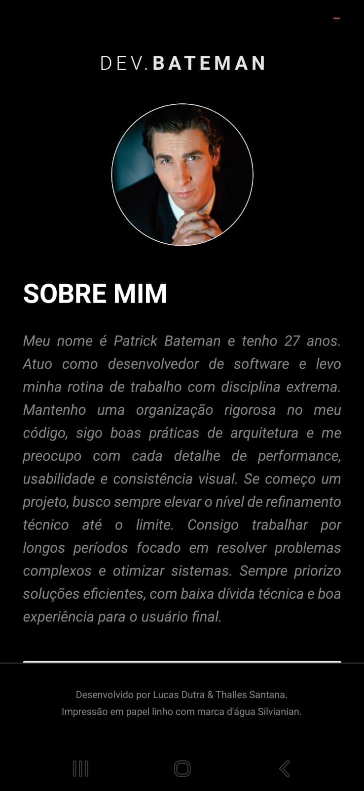

# Dev.Bateman - Portfolio Mobile

Um aplicativo mobile desenvolvido em React Native com Expo, apresentando um portfólio individual com uma temática parodiando o personagem Patrick Bateman (American Psycho, 2000).

## 👤 Desenvolvedores
* **Lucas Dutra**
* **Thalles Santana**

## 🎯 Objetivo do Projeto
Este projeto foi desenvolvido como uma atividade académica para estudar:
- **Componentização:** Criação de elementos de interface reutilizáveis e desacoplados.
- **Navegação Avançada:** Uso de `Native Stack Navigator` para transição entre ecrãs.
- **Estado Global (Context API):** Implementação de um `ThemeProvider` para alternância de temas (Escuro/Claro) em tempo real.
- **Animações Nativas:** Uso da biblioteca `Animated` para efeitos de *Fade In* na entrada dos ecrãs.

## 🚀 Tecnologias Utilizadas
- [React Native](https://reactnative.dev/)
- [Expo SDK 55](https://expo.dev/)
- [TypeScript](https://www.typescriptlang.org/)
- [React Navigation](https://reactnavigation.org/)
- [Context API](https://react.dev/learn/passing-data-deeply-with-context) (Gerenciamento de Tema)

## 🛠️ Funcionalidades principais
- **Ecrã Home:** Apresentação executiva, botões de ação e controle de "Modo Executivo" (Theme Switch).
- **Ecrã Sobre Mim:** Monólogo icónico adaptado ao contexto de desenvolvimento de software.
- **Troca de Tema:** Alterna entre o modo *Dark* e o modo *Executive Light* (cor de papel linho).
- **Animações:** Transições suaves de opacidade ao navegar ou focar nos ecrãs.
- **Links Duplos:** O botão de redes sociais abre os perfis de ambos os desenvolvedores (Lucas e Thalles) com um único clique.

## 📸 Telas do App

### Home

### Sobre Mim

## 📦 Como rodar o projeto

1. Abra o terminal e use o seguinte código para clonar o repositório:
    `git clone https://github.com/lucasjdutra/dev-spot.git`

2. Acesse o diretorio:
    `cd dev-spot`

3. Instale as dependências:
    `npm install`
    
4.  Inicie o projeto:
    `npx expo start`
        ou
    `npx expo start -c`

5. Escaneie o QR Code no App "Expo GO"